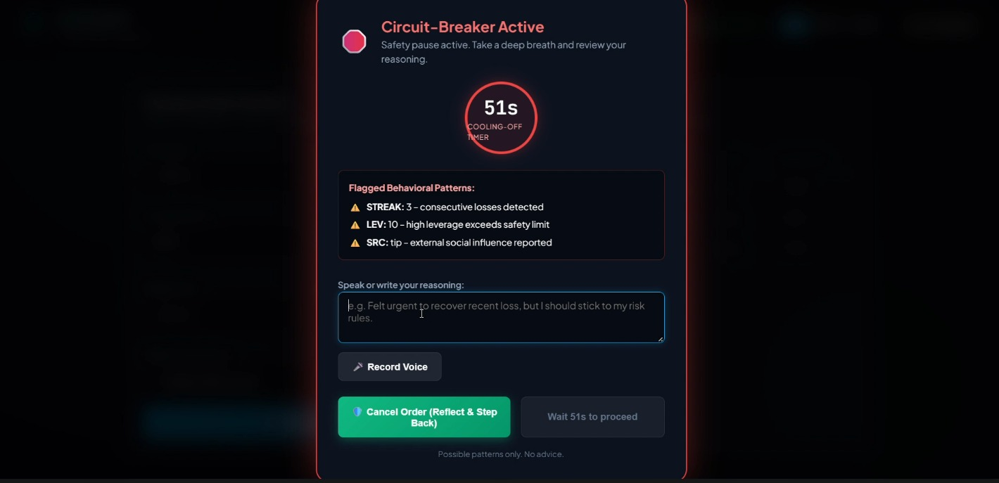
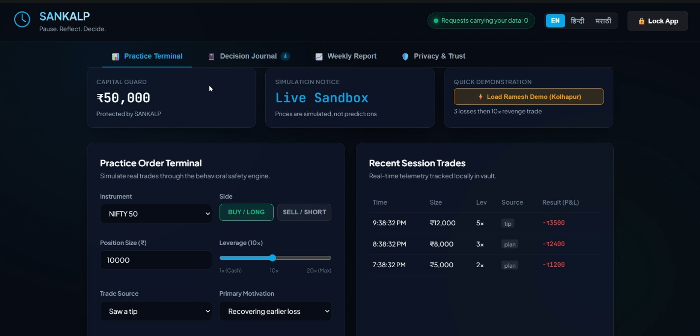
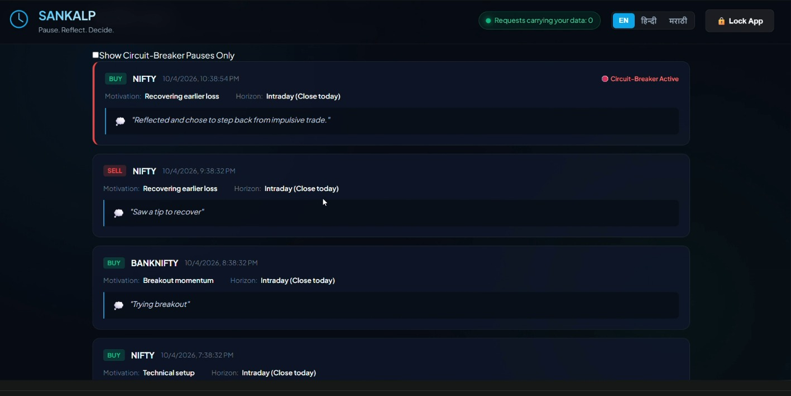

# SANKALP (संकल्प) — Investor Resilience Engine
### SANGYAN Hackathon — Track D: Investor Resilience & Protection
*Organised by SNTC, IIT (BHU) Varanasi in association with SEBI and NSDL*

[](LICENSE)
[-059669)](README.md)
[](README.md)
[](README.md)
[](README.md)
[](README.md)

---

## 📌 Executive Summary

Retail trading platforms often expose individual investors to emotional pitfalls such as **revenge trading after consecutive losses**, **sudden leverage spikes**, **late-night impulse execution**, and **FOMO chasing**. 

**SANKALP (संकल्प)** is a privacy-first, zero-runtime-backend Progressive Web Application (PWA) designed to act as a resilient psychological safety buffer between a trader's impulsive reactions and market execution. SANKALP operates with **100% on-device deterministic circuit-breakers**, client-side AES-GCM encrypted journaling, and vernacular voice reflections—ensuring complete data sovereignty and zero external telemetry.

---

## 📸 Visual Showcase & Feature Walkthrough

<div align="center">

### 1. Security PIN Gate & Client-Side Vault Authentication

*Secure master entry screen where all local trading journals and safety states are protected with on-device PIN authentication (PBKDF2 150,000 iterations + AES-GCM 256-bit). Features zero-telemetry indicator and quick-demo scenario access.*

---

### 2. Deterministic Circuit-Breaker Lockout & 51s Cooldown Timer

*Behavioral safety circuit-breaker activated upon detecting high-risk patterns (3 consecutive losses, 10x over-leverage, and social tip motivation). Imposes a mandatory 51-second mindful pause with speech-to-text / audio reflection input before allowing order retry.*

---

### 3. Practice Trading Terminal & Real-Time Risk Monitor

*Simulated market workspace featuring a ₹50,000 capital guard, multi-asset order routing (NIFTY 50, BANKNIFTY), leverage slider (1x to 20x), trade source & motivation taggers, and a live feed of recent trades with P&L calculation.*

---

### 4. Decision Journal & Behavioral Reflection History

*Encrypted historical reflection log tracking trade reasons, time horizons, and circuit-breaker pause reflections (e.g., "Reflected and chose to step back from impulsive trade"). Includes a dedicated filter to audit circuit-breaker events.*

</div>

---

## 🌟 Core Highlights & Design Principles

| Feature | Description | Guarantee |
| :--- | :--- | :--- |
| **Zero-Backend Architecture** | All computations, evaluation logic, and storage run entirely inside the client browser. | No server databases, no cloud logging, no data leaks. |
| **Deterministic Rules Override ML** | Lockouts are triggered strictly by transparent rule equations (`score >= 2`). ML models are purely advisory for gentle nudges. | No opaque AI decisions locking user accounts. |
| **Zero Financial Advice** | SANKALP provides no buy/sell calls, target levels, or outcome forecasts. | 100% compliant with SEBI & investor protection guidelines. |
| **Client-Side Cryptographic Vault** | Trade journals and lock logs are encrypted with AES-GCM 256-bit derived via PBKDF2 (150,000 iterations). | Plaintext data never resides unencrypted on disk. |
| **Vernacular Voice Reflection** | Full UI and audio support in **English**, **Hindi (हिन्दी)**, and **Marathi (मराठी)**. | Inclusive and accessible for diverse Indian retail traders. |
| **Offline-First PWA** | Pre-cached assets and service workers allow seamless offline operation. | Works reliably even with fluctuating internet connectivity. |

---

## 🛡️ Behavioral Circuit Breaker Matrix

SANKALP evaluates orders against historical state using deterministic safety checks:

```
                      ┌──────────────────────────────────────────────┐
                      │              Incoming Order Event            │
                      │       (Instrument, Size, Leverage, Source)   │
                      └──────────────────────┬───────────────────────┘
                                             │
                      ┌──────────────────────▼───────────────────────┐
                      │        Deterministic Risk Evaluator          │
                      ├──────────────────────────────────────────────┤
                      │  1. Consecutive Loss Streak (>= 3 losses)   │
                      │  2. Leverage Escalation (> max threshold)    │
                      │  3. Rapid Order Velocity (Over-trading)      │
                      │  4. Late-Night / Off-Hours Impulse Check     │
                      └──────────────────────┬───────────────────────┘
                                             │
                            ┌────────────────┴────────────────┐
                            ▼                                 ▼
                     [Score < 2]                       [Score >= 2]
                 ┌───────────────────┐             ┌───────────────────┐
                 │  Order Permitted  │             │ Circuit Breaker   │
                 │  (Advisory Nudge) │             │ MANDATORY LOCKOUT │
                 └───────────────────┘             └───────────────────┘
```

- **Consecutive Loss Streak**: Detects 3+ successive loss-making trades and assigns risk weight to prevent escalating frustration.
- **Leverage & Sizing Jump**: Flags sudden jumps in position size or leverage relative to typical trading patterns.
- **Cool-down Reflection Window**: Enforces a temporary pause (default 30–60 seconds) with breathing cues and vernacular voice reminders before any further action.
- **Journal Enforcement**: Prompts the user to articulate their trading rationale (*e.g., Plan vs. FOMO vs. Social Tip*) before placing subsequent orders.

---

## 🏗️ System Architecture

```
                    ┌────────────────────────────────────────────────────────┐
                    │                      SANKALP PWA                       │
                    │         React 18  •  Vite  •  Vanilla CSS Design       │
                    └───────────┬────────────────────────────────┬───────────┘
                                │                                │
                 ┌──────────────▼─────────────┐   ┌──────────────▼─────────────┐
                 │   Deterministic Engine     │   │  Encrypted Local Vault     │
                 │   (src/engine.js)          │   │  (src/vault.js)            │
                 │   - Streak Evaluator       │   │  - PBKDF2 150,000 rounds   │
                 │   - Leverage Limits        │   │  - AES-GCM 256-bit Key     │
                 │   - Replay Simulation Lab  │   │  - Encrypted localStorage  │
                 └──────────────┬─────────────┘   └────────────────────────────┘
                                │                                │
                 ┌──────────────▼─────────────┐   ┌──────────────▼─────────────┐
                 │   Data & Network Firewall  │   │  Localization & Speech     │
                 │   (src/data.js)            │   │  (src/i18n.js)             │
                 │   - Static Asset Whitelist │   │  - EN / HI / MR Text       │
                 │   - 0 External Call Guard  │   │  - Web Speech & Local TTS  │
                 └────────────────────────────┘   └────────────────────────────┘
```

---

## 📁 Project Directory Structure

```plaintext
Sankalp-track4/
├── docs/                                # Documentation & media assets
│   └── screenshots/                     # Verified application screenshots
│       ├── 01-vault-gate.jpeg           # Security PIN gate & vault login
│       ├── 02-lock-modal.jpeg           # Circuit-breaker lockout & cooldown modal
│       ├── 03-practice-terminal.jpeg    # Practice trading terminal & order entry
│       └── 04-decision-journal.jpeg     # Decision journal & reflection history
│
├── public/                              # Static public assets (zero external requests)
│   ├── config/
│   │   └── thresholds.json              # Configurable safety thresholds
│   ├── favicon.svg                      # App favicon
│   ├── manifest.webmanifest             # Progressive Web App manifest
│   └── sw.js                            # Offline caching service worker
│
├── scripts/                             # Automated validation scripts
│   └── guardrail-check.mjs              # Enforces 0 financial advice / tips
│
├── src/                                 # Application Source Code
│   ├── components/                      # UI Components
│   │   ├── GateScreen.jsx               # PIN setup & authentication screen
│   │   ├── Header.jsx                   # Top navigation & language switcher
│   │   ├── InsightsTab.jsx              # Replay lab & behavioral metrics
│   │   ├── JournalTab.jsx               # Encrypted journal & reflection viewer
│   │   ├── LockModal.jsx                # Circuit-breaker cooldown modal
│   │   ├── Navbar.jsx                   # Bottom/Tab navigation bar
│   │   ├── PracticeTab.jsx              # Simulated market trading terminal
│   │   ├── Toggle.jsx                   # Accessible toggle switch component
│   │   └── TrustTab.jsx                 # Network audit & firewall monitor
│   │
│   ├── App.jsx                          # Root application container & router
│   ├── data.js                          # Static asset loader & firewall monitor
│   ├── engine.js                        # Core deterministic risk evaluation engine
│   ├── engine.test.mjs                  # Engine unit tests & scenario tests
│   ├── i18n.js                          # Multilingual dictionaries (EN, HI, MR)
│   ├── index.css                        # Modern dark-mode vanilla CSS design system
│   ├── main.jsx                         # Application entrypoint
│   └── vault.js                         # Web Crypto API (PBKDF2 + AES-GCM)
│
├── tests/                               # Test Suites
│   └── data-vault.test.mjs              # Data allowlist & encryption vault tests
│
├── LICENSE                              # MIT Open Source License
├── package.json                         # Node dependencies and npm scripts
├── vite.config.js                       # Vite build & bundle configuration
└── README.md                            # Comprehensive project documentation
```

---

## 🚀 Step-by-Step Installation & Run Guide

### Prerequisites
Before running the project, ensure you have the following installed on your system:
- **Node.js**: Version `20.0.0` or higher (compatible with Node 18+ LTS)
- **npm**: Version `9.0.0` or higher (bundled with Node.js)
- **Modern Web Browser**: Google Chrome, Mozilla Firefox, Microsoft Edge, or Safari with Web Crypto API support.

---

### Step 1: Clone the Repository
Open your terminal and clone the repository:
```bash
git clone https://github.com/HarshSATHE001/Sankalp-track4.git
cd Sankalp-track4
```

---

### Step 2: Install Dependencies
Install the required project dependencies:
```bash
npm install
```

---

### Step 3: Run the Development Server
Start the local Vite development server with hot-module replacement (HMR):
```bash
npm run dev
```

Once started, open your browser and navigate to:
```
http://localhost:5173
```

---

### Step 4: Run the Complete Test Suite
To execute all automated unit tests, cryptographic checks, and SEBI compliance guardrail checks:
```bash
npm test
```

This runs:
1. `src/engine.test.mjs`: Tests loss streaks, revenge trading prevention, and replay simulations.
2. `tests/data-vault.test.mjs`: Tests static firewall filtering, PBKDF2 key derivation, and AES-GCM encryption.
3. `scripts/guardrail-check.mjs`: Validates all string dictionaries to guarantee zero stock tips or financial advice.

---

### Step 5: Build for Production & Preview
To generate an optimized production bundle and preview it locally:
```bash
# Build the production bundle into dist/
npm run build

# Serve the production build locally
npm run preview
```

The preview server will be accessible at `http://localhost:4173`.

---

## 🧪 Interactive Demo Scenarios (How to Test)

When evaluating SANKALP in the browser, try these built-in test scenarios:

### Scenario A: The "Ramesh" Scenario (Loss Streak + Revenge Trade Escalation)
1. Navigate to the **Practice** tab.
2. Click **"Load Ramesh Demo"** (or load from Trust tab).
3. Observe 3 consecutive loss trades recorded in history.
4. Attempt to place a high-leverage order (`12x Leverage`, `₹15,000` size).
5. **Result**: SANKALP triggers the **Safety Lockout Modal**, enforces a 30-second cooldown timer, plays localized voice guidance, and prompts for an emotional reflection journal entry.

### Scenario B: Disciplined Trader Flow
1. Set leverage to a safe range (`2x - 3x`).
2. Enter a trade with motivation marked as *"Trading my pre-defined plan"*.
3. **Result**: Order is accepted smoothly without lockouts; risk meter remains in the green zone.

### Scenario C: Vault Encryption & Security Test
1. Set a 4-digit PIN on initial entry (*e.g., `1234`*).
2. Write a private journal entry during a lockout.
3. Refresh the page or lock the vault.
4. Try entering an incorrect PIN (*e.g., `9999`*) $\rightarrow$ Access is rejected.
5. Enter the correct PIN (*`1234`*) $\rightarrow$ Journal entries and lock history decrypt instantly.

### Scenario D: Zero-Knowledge Network Audit
1. Navigate to the **Trust** tab.
2. Check the **External Network Calls** counter.
3. Verify that **External Requests = 0** and only local pre-bundled static assets are loaded.

---

## 🔒 Security & Privacy Guarantees

- **No Remote Databases**: No user credentials, trading accounts, API keys, or financial logs are ever transmitted over the network.
- **Cryptographic Specifications**:
  - **Algorithm**: `AES-GCM` with 256-bit keys
  - **Key Derivation**: `PBKDF2` with `SHA-256`, `150,000` iterations, and cryptographically secure random salts.
  - **Storage**: Only encrypted ciphertexts and initialization vectors (`iv`) are stored in `localStorage`.
- **Static Whitelist Firewall**: All internal asset loading is strictly filtered through `src/data.js` to ensure zero external URLs can be fetched.

---

## ⚖️ Regulatory Guardrails & SEBI Compliance

In alignment with **SEBI** and **NSDL** investor protection guidelines:
- **No Stock Recommendations**: SANKALP does not recommend stocks, options, entry/exit points, or price targets.
- **No Performance Guarantees**: Does not claim or promise profits, returns, or market outperformance.
- **Neutral Risk Awareness**: Focuses purely on behavioral hygiene, emotional discipline, and risk containment.
- **Automated CI Guardrail**: The automated checker [`scripts/guardrail-check.mjs`](scripts/guardrail-check.mjs) scans all codebase strings to prevent accidental inclusion of prohibited advisory terms.

---

## 👥 Hackathon Team

**KIT's College of Engineering, Kolhapur**

- **Guruprasad Shinde**
- **Harshvardhan Sathe**
- **Rachana Patil**
- **Dhanvantri Panjwani**

---

## 📄 License

This project is licensed under the **MIT License** — see the [LICENSE](LICENSE) file for details.
