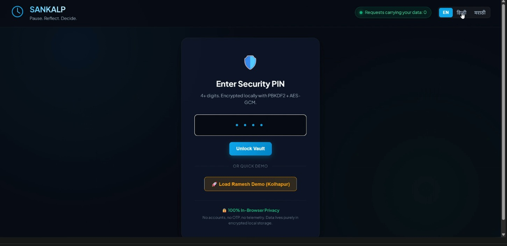

# SANKALP (संकल्प) — Investor Resilience Engine
**SANGYAN Hackathon — Track D: Investor Resilience & Protection**

[](LICENSE)
[-emerald)](README.md)
[](README.md)
[](README.md)

SANKALP is a privacy-first, zero-runtime-backend Progressive Web Application (PWA) designed to protect retail investors and active traders from impulsive, revenge, and FOMO trading behaviors. Using deterministic behavioral circuit-breakers, client-side encryption, and on-device reflection journaling, SANKALP creates a protective buffer between emotional impulses and market execution.

---

## 📸 Application Preview

<div align="center">

### 1. Practice & Simulated Order Execution

*Simulated market execution environment with real-time risk assessment and leverage controls.*

---

### 2. Deterministic Safety Lock & Cooldown Timer

*Deterministic circuit-breaker triggering mandatory cool-down pauses and vernacular voice reflections.*

---

### 3. Encrypted Reflection Journal

*Client-side encrypted trade reflections secured with PBKDF2 (150,000 rounds) and AES-GCM 256-bit encryption.*

---

### 4. Zero-Knowledge Trust & Network Audit

*Real-time network traffic auditor verifying 0 external telemetry or data-carrying requests.*

</div>

---

## 🌟 Core Highlights

- **100% In-Browser & Zero-Backend**: All trading evaluations, circuit-breaker locks, encrypted storage, and safety scoring occur strictly client-side. No financial data, trades, P&L, PINs, or typed thoughts ever leave the user's browser.
- **Rules Override ML**: Safety lockouts are strictly governed by transparent, deterministic behavioral rules (`score >= 2`). Machine learning is purely advisory and only issues subtle nudges—it never locks or unlocks accounts.
- **Zero Financial Advice**: SANKALP does not provide buy/sell signals, target prices, or outcome predictions. Market patterns are flagged neutrally to promote deliberate decision-making.
- **Multilingual Support**: Fully localized in English, Hindi (हिन्दी), and Marathi (मराठी), including offline-ready localized voice alerts.
- **Encrypted Local Vault**: Trade journal and lock history are encrypted client-side using PBKDF2 (150,000 iterations) and AES-GCM 256-bit encryption.
- **Offline First**: Runs completely offline after first load with PWA service worker caching.

---

## 🛡️ Architecture & Guardrails

```
                    ┌──────────────────────────────────────────────┐
                    │               SANKALP PWA                    │
                    │   (Vite + React, Vanilla CSS, Zero-Backend)   │
                    └───────┬──────────────────────────────┬───────┘
                            │                              │
             ┌──────────────▼─────────────┐ ┌──────────────▼─────────────┐
             │    Deterministic Engine    │ │   Encrypted Storage Vault   │
             │   (streak, sizing, cool)   │ │  (PBKDF2 150k + AES-GCM)   │
             └──────────────┬─────────────┘ └────────────────────────────┘
                            │
             ┌──────────────▼─────────────┐
             │   Int8 Anomaly Detector    │
             │    (Advisory Nudges Only)  │
             └────────────────────────────┘
```

1. **Deterministic Lock Mechanism**: Evaluates order frequency, leverage limits, streak losses, and late-night trading bursts.
2. **Cool-down Pause**: Enforces a temporary pause window before impulsive trades execute.
3. **Local Journal**: Prompts the trader to document reasons and emotional triggers during locked periods.

---

## 🚀 Quick Start

### Prerequisites
- Node.js >= 20.0.0
- npm >= 9.0.0

### Installation & Run

```bash
# Clone the repository
git clone https://github.com/HarshSATHE001/Sankalp-track4.git
cd Sankalp-track4

# Install dependencies
npm install

# Start local development server (Vite)
npm run dev

# Run full test suite (Engine + Data + Vault + Guardrail validation)
npm test

# Build production bundle
npm run build

# Preview production build locally
npm run preview
```

---

## 📋 Third-Party Disclosure & Limits

### Third-Party Disclosures
- **Frontend Framework**: React 18 & Vite
- **Voice Synthesis**: Standard Browser Web Speech API (opt-in) with fallback to pre-rendered static Bhashini audio assets.
- **Data & Network Requests**: Zero external telemetry or analytics. All static resources loaded from same-origin bundle.

### Honest Limits
- **Encrypted Local Storage**: SANKALP uses AES-GCM with PBKDF2 encrypted `localStorage`. While robust for client-side privacy, user PIN strength dictates key resilience.
- **Anomaly Detection Scope**: In-browser anomaly model is trained on synthetic behavioral archetypes and acts strictly as an early-warning nudge, not an absolute predictor.

---

## 👥 Team

**KIT's College of Engineering, Kolhapur**

- **Guruprasad Shinde**
- **Harshvardhan Sathe**
- **Rachana Patil**
- **Dhanvantri Panjwani**

Built for **SANGYAN: Investor Resilience Hackathon**, organised by SNTC, IIT (BHU) Varanasi with SEBI and NSDL. SANKALP is a public-good project: no stock tips, no predictions, no monetisation.

---

## 📄 License

This project is licensed under the MIT License - see the [LICENSE](LICENSE) file for details.
